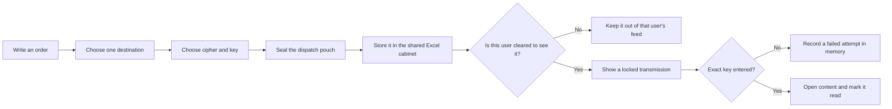
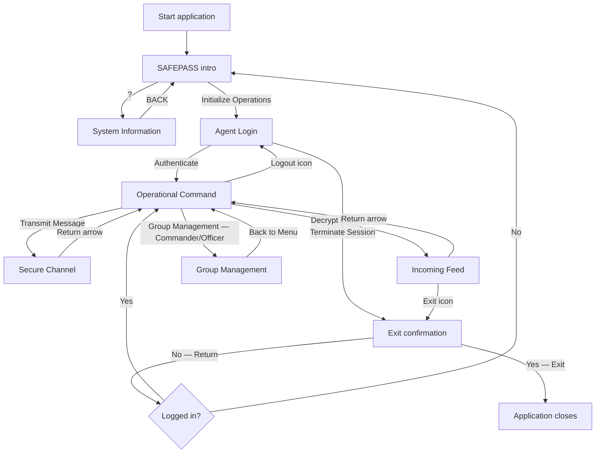
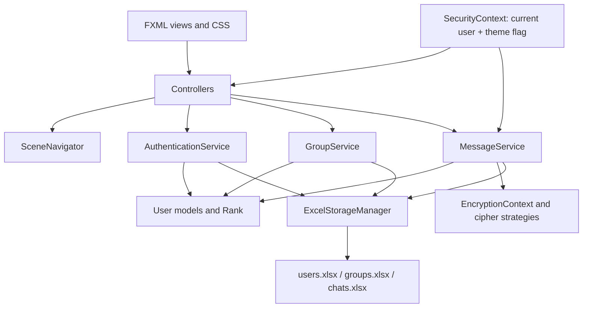

# SafePass / War-Time Information Passing System

## Complete User and Operator Instructions

| Document item | Value |
|---|---|
| Application | SafePass — War-Time Information Passing System |
| Project directory | `WarTimeInfoSystem_v11/` |
| Application type | Local JavaFX desktop simulation |
| Required Java level | Java 17 or newer |
| UI framework | JavaFX 20 |
| Build tool | Maven |
| Persistent storage | Three local Excel workbooks (`.xlsx`) |
| Primary launch class | `com.wartime.system.Launcher` |

> **Important:** This application demonstrates secure-message workflows and object-oriented design. It is **not** suitable for real military, emergency, classified, personal, or production communications. Its passwords and message keys are stored as readable text in local Excel files, and its ciphers are educational rather than modern cryptography.

---

## 1. What the application does

SafePass is a single-computer message-passing simulation with three personnel ranks:

- **Commander** — highest clearance; sees all transmissions, manages every group, and can issue emergencies.
- **Officer** — middle clearance; can create and edit eligible groups and use ordinary transmissions.
- **Soldier** — standard clearance; can send messages and decrypt messages made visible to that user.

Users can send four types of information:

1. A rank-wide transmission addressed to Commander, Officer, or Soldier clearance.
2. A private transmission addressed to one named user.
3. A group transmission addressed to a selected operational group.
4. A commander-only emergency broadcast visible to everyone.

Ordinary transmissions require an encryption method and a manually shared key. Mission briefs are ordinary encrypted transmissions with a structured Mission, Location, Time, and Commander layout.

### The sealed-dispatch analogy

Think of SafePass as a **shared field dispatch cabinet**:

- The message is the paper order.
- The cipher is the kind of lock placed on its pouch.
- The manual key is the pouch combination.
- The target is the address label.
- Rank and group rules are the guard at the cabinet.
- The Excel workbooks are the cabinet itself.



The analogy has one crucial limitation: this is one shared cabinet, not separate mailboxes. Read status and deletion apply to the stored message globally, not separately for each recipient.

---

## 2. Before you run it

### 2.1 Prerequisites

Install and make available on your command line:

| Requirement | How to check | Expected result |
|---|---|---|
| JDK 17+ | `java -version` | Java 17 or a newer compatible JDK |
| Maven | `mvn -version` | Maven information plus the selected Java runtime |
| Network on first build | Not applicable | Maven can download JavaFX and Apache POI dependencies |
| Desktop session | Not applicable | A graphical display is available for JavaFX |

The project compiles for Java 17 and declares JavaFX 20. It also uses Apache POI 5.2.3 to read and write Excel files.

### 2.2 Always start in the project directory

The data path is relative to the process's current working directory. Change into the application directory before launching:

```bash
cd /WarTimeInfoPassingSystem/WarTimeInfoSystem_v11
```

If the app is launched from another directory, it may create a different `data/storage/` folder there. This can look like lost users, groups, or messages even though the original files still exist.

### 2.3 Launch from a terminal

From `WarTimeInfoSystem_v11/`, run:

```bash
mvn clean javafx:run
```

For later launches, when a clean rebuild is unnecessary:

```bash
mvn javafx:run
```

The first build may take longer while Maven downloads dependencies. The window opens at approximately 85% of the primary screen's usable width and height.

### 2.4 Launch from an IDE

1. Open `WarTimeInfoSystem_v11/pom.xml` as a Maven project.
2. Select a JDK 17-or-newer project SDK.
3. Allow Maven dependency import to finish.
4. Run `com.wartime.system.Launcher`.

Use `Launcher`, especially when an IDE has difficulty launching a class that directly extends JavaFX `Application`.

> A JAR produced by `mvn package` is not a self-contained or “fat” JAR. Prefer `mvn javafx:run` unless the project is later packaged with its runtime dependencies.

---

## 3. Default accounts

The following accounts are seeded whenever the app starts. Usernames and passwords are case-sensitive.

| Rank selected at login | Operative ID | Passcode |
|---|---|---|
| COMMANDER | `cmd1` | `cmd1_123` |
| COMMANDER | `cmd2` | `cmd2_123` |
| COMMANDER | `cmd3` | `cmd3_123` |
| OFFICER | `offcr1` | `offcr1_123` |
| OFFICER | `offcr2` | `offcr2_123` |
| OFFICER | `offcr3` | `offcr3_123` |
| SOLDIER | `soldr1` | `soldr1_123` |
| SOLDIER | `soldr2` | `soldr2_123` |
| SOLDIER | `soldr3` | `soldr3_123` |
| SOLDIER | `soldr4` | `soldr4_123` |
| SOLDIER | `soldr5` | `soldr5_123` |

Each login needs all three fields to agree: Operative ID, Clearance Level, and Passcode. Selecting the wrong rank for a valid username is rejected.

The application has no user-registration screen. Although its service layer supports registration, normal operators can only use accounts already present in `users.xlsx`. The eleven coded default accounts and their coded passwords are written back on every startup, so manually changing a default password in the workbook will not persist after the next launch.

---

## 4. Screen and navigation map



| Screen | Main controls | Purpose |
|---|---|---|
| SAFEPASS intro | `?`, **Initialize Operations** | View brief app information or continue to login |
| Agent Login | Operative ID, rank, password, eye icon, **AUTHENTICATE** | Establish the current user and clearance |
| Operational Command | **TRANSMIT MESSAGE**, **DECRYPT INBOX**, **GROUP MANAGEMENT**, logout icon | Main module selection |
| Secure Channel | Target selectors, priority, message/mission brief, cipher, key, **TRANSMIT** | Compose and send information |
| Incoming Feed | **PRIVATE**, **GROUP**, transmission list, return and exit icons | Review, decrypt, and delete visible transmissions |
| Group Management | Group form, personnel list, existing groups | Create, edit, and delete groups according to rank |
| Exit confirmation | **YES (EXIT)**, **NO (RETURN)** | Confirm or cancel application termination |

Two alternative FXML files, `MainDashboard.fxml` and `MessageCenter.fxml`, exist as UI-refactor prototypes. Current navigation does **not** load them; the live screens are `option.fxml` and `sender.fxml`.

---

## 5. Rank permissions and message visibility

### 5.1 Permission summary

| Capability | Commander | Officer | Soldier |
|---|:---:|:---:|:---:|
| Send an ordinary transmission | Yes | Yes | Yes |
| Receive and decrypt visible transmissions | Yes | Yes | Yes |
| See every stored transmission | Yes | No | No |
| Send an emergency broadcast | Yes | No | No |
| Open Group Management from the menu | Yes | Yes | No |
| Create a group | Yes | Yes, if a Commander is selected as a member | No |
| View groups | All groups | Groups where the Officer is a member | Not available from menu; service visibility is membership-based |
| Edit a group | Any listed group | Any listed group where the Officer is creator or member | No |
| Delete a group | Yes | No | No |

### 5.2 Who sees each destination type

The Commander override is applied first: every Commander can see every transmission, including messages privately addressed to someone else.

| Destination selected by sender | Commander sees it | Officer sees it | Soldier sees it |
|---|---|---|---|
| Individual recipient | Always | Only if that Officer is the named recipient | Only if that Soldier is the named recipient |
| Group | Always | If a member of the group | If a member of the group |
| COMMANDER rank | Yes | No | No |
| OFFICER rank | Yes | Yes | No |
| SOLDIER rank | Yes | Yes | Yes |
| Emergency | Yes | Yes | Yes |

For a private or group transmission, a non-Commander sender is not automatically able to see their own sent message. They see it later only if they are also the named recipient or a member of the target group.

### 5.3 Clearance-ladder analogy

Rank broadcasts act like posting an order at a checkpoint on a three-step ladder:

```text
Highest clearance      COMMANDER  ← can read COMMANDER, OFFICER, SOLDIER targets
                              │
Middle clearance        OFFICER  ← can read OFFICER and SOLDIER targets
                              │
Standard clearance      SOLDIER  ← can read SOLDIER targets
```

The destination rank is therefore the **lowest clearance allowed to read**, not a list containing only that rank.

---

## 6. First login

1. On the intro screen, select **Initialize Operations**.
2. Enter an Operative ID, such as `cmd1`.
3. Select the matching rank, such as **COMMANDER**.
4. Enter its passcode, such as `cmd1_123`.
5. Use the eye icon to show or hide the password if needed.
6. Select **AUTHENTICATE**.
7. After success, the **OPERATIONAL COMMAND** screen appears.

If any field is empty, the app asks you to fill all fields. If the ID, rank, or password does not match, it shows **Access Unauthorised** and clears both password fields.

---

## 7. Send an ordinary encrypted transmission

Open **TRANSMIT MESSAGE** from the Operational Command screen.

### 7.1 Complete the transmission in this order

1. **Choose exactly one destination:**
   - **Target Group** for a group operation;
   - **Individual Recipient** for one named user; or
   - **Authorizing Appointment** for a rank-wide broadcast.
2. Select **NORMAL**, **WARNING**, or **CRITICAL**. NORMAL is selected initially.
3. Type the message in **Enter confidential directive...**.
4. Select an **Encryption Strategy**.
5. Enter a non-empty **Manual Key**.
6. Select **TRANSMIT**.
7. Confirm the **Message Sent successfully!** dialog.

Selecting a group clears and disables the rank and individual selectors. Selecting an individual clears and disables the group and rank selectors. If the active dropdown does not let you return it to an empty value, use the return arrow and reopen **TRANSMIT MESSAGE** to reset all destination selectors.

The app rejects a transmission when the message, encryption method, key, or destination is missing.

### 7.2 Destination guidance

| Goal | Selector to use | Example |
|---|---|---|
| Send only to one Soldier | Individual Recipient | `soldr2 (SOLDIER)` |
| Send to a task force | Target Group | `Attack Wing` |
| Send to Commander and Officer ranks | Authorizing Appointment | `OFFICER` |
| Send to everyone through the rank ladder | Authorizing Appointment | `SOLDIER` |
| Send an urgent all-personnel plaintext alert | Commander emergency control | See Section 10 |

### 7.3 Priority meanings

Priorities affect the stored label and inbox color; they do not change delivery speed, access, encryption, or sorting beyond unread/read ordering.

| Priority | Intended use | Inbox appearance while unread |
|---|---|---|
| NORMAL | Routine operational information | Green text |
| WARNING | Elevated attention | Yellow text and warning badge |
| CRITICAL | Immediate attention | Red text and critical badge |

Emergency is a separate transmission type and is not created merely by selecting CRITICAL.

---

## 8. Choose an encryption method and key

| UI option | Transformation used | Does transformation use the key? | Practical note |
|---|---|:---:|---|
| Caesar Cipher | Shifts letters by `key length mod 26` | Yes, only its length | Case is preserved; numbers and punctuation are unchanged |
| Reverse Cipher | Reverses all characters | No | The saved key is still required for opening |
| XOR Cipher | XORs each character with repeating key characters | Yes | Stored output can contain unreadable/control characters |
| Base64 Encoding | Base64-encodes message bytes | No | Encoding, not encryption; the saved key is still required for opening |

Even where the transformation ignores the key, the receiver must enter the exact stored key because the application checks key equality before reversing the transformation.

Key rules:

- The key cannot be empty.
- Leading and trailing whitespace is removed by the send and receive screens.
- Keys are case-sensitive.
- The app has no key-recovery workflow.
- Share the key separately for the simulation; do not send a key inside the message it protects.

> **Security reality:** Caesar, Reverse, XOR-as-implemented, and Base64 are not suitable for real secure communications. The workbook also stores every key in plaintext.

---

## 9. Send a structured Mission Brief

Mission Brief mode produces a consistently formatted encrypted message.

1. Open **TRANSMIT MESSAGE**.
2. Select a destination, priority, cipher, and key as for any ordinary transmission.
3. Turn on **Mission Brief**.
4. Complete all four fields:
   - **Mission**
   - **Location**
   - **Time**
   - **Commander** — this list contains Commander-rank accounts only
5. Select **TRANSMIT**.

The app builds this text before encryption:

```text
[MISSION BRIEF]
Mission: <mission>
Location: <location>
Time: <time>
Commander: <selected commander>
```

After successful decryption, the receiver renders these fields as a mission-brief panel rather than a plain text box.

The selected Mission Commander is descriptive data; it does not alter the sender, destination, access rules, or permissions.

---

## 10. Send a Commander emergency broadcast

Only a logged-in Commander sees **⚠ INITIATE EMERGENCY**.

1. Open **TRANSMIT MESSAGE** as a Commander.
2. Keep Mission Brief mode off.
3. Type the emergency text in the ordinary message area.
4. Select **⚠ INITIATE EMERGENCY**.
5. Confirm the success dialog.

No destination, priority, cipher, or key is required. The emergency text is stored directly and becomes visible to all users.

When a user next opens **DECRYPT INBOX**, each unread emergency appears in a modal red alert. The user must select **ACKNOWLEDGE**. The message is then marked read.

> Read status is global. Once one user acknowledges an emergency, other users may not receive it automatically as a pending popup. It remains in the Private/Rank feed until deleted and can be opened by double-clicking it.

---

## 11. Find and filter target groups

The Target Group selector initially contains the groups visible to the logged-in user:

- Commanders receive all groups.
- Officers receive only groups in which they are members.

Double-click the **Target Group** selector to open the filter dialog. Available filters are:

| Filter | Values | Behavior |
|---|---|---|
| Category | AIR, NAVAL, LAND, ATTACK, LOGISTIC, OTHER | Exact category match |
| Year | Current year down to 2020 | Creation-year match |
| Month | 1 through 12 | Creation-month match |
| Specific Date | Calendar date | Exact creation-date match |

Multiple filters are combined with **AND**. The dialog shows the count of matching groups. Select **APPLY FILTER** to replace the group dropdown's current list, or **CLEAR ALL FILTERS** to reset fields inside the dialog.

To restore all groups after applying a filter, reopen the Secure Channel screen or clear all filters and apply again.

---

## 12. Use the Incoming Feed and decrypt a message

Open **DECRYPT INBOX** from Operational Command.

### 12.1 Feed tabs

| Tab | Contains |
|---|---|
| PRIVATE | Individual messages, rank broadcasts, and emergency broadcasts |
| GROUP | Messages with a target group |

Unread entries appear before read entries. A solid dot (`●`) marks an unread message. Entries show a runtime-generated hexadecimal transmission ID, not a permanent database ID.

The displayed prefixes are:

- `[⚠ EMERGENCY]` for an emergency;
- `[PRIVATE]` for a named-recipient transmission;
- `[GROUP]` for everything else.

Because of that last display rule, a rank broadcast can show a `[GROUP]` prefix even though it is correctly located in the **PRIVATE** (Private/Rank) feed.

### 12.2 Decrypt an ordinary transmission

1. Select the appropriate **PRIVATE** or **GROUP** tab.
2. Double-click a transmission.
3. Enter the exact Decryption Key.
4. Select **Decrypt**.
5. Read the opened text or structured mission brief.
6. Select **Close**.

After successful viewing, the message is marked read and its failed-attempt count is cleared.

### 12.3 Wrong keys and the intrusion animation

For the first and second failed attempts on a message, the app reports the attempt number. On the third failure, it shows an **INTRUSION DETECTED** animation and resets that message's counter to zero.

The displayed coordinates, “GPS TRACKER ACTIVATED,” and “REPORTING TO COMMAND CENTER” messages are **simulated visual effects only**. The app does not access GPS, determine a real location, use a network, or send a report anywhere.

Failed-attempt counts are held only in the current Incoming Feed controller's memory. Leaving and reopening the screen also resets them.

### 12.4 Delete a transmission

Right-click a visible transmission and choose **Delete Transmission**.

There is no confirmation dialog and no role check. Deletion immediately removes the message from the shared store for every user. Use this control carefully and make a data backup if recovery could be needed.

---

## 13. Manage groups

Group Management is available from the main menu only to Commanders and Officers.

### 13.1 Group categories

| Category | Suggested meaning |
|---|---|
| AIR | Air operations |
| NAVAL | Maritime operations |
| LAND | Ground operations |
| ATTACK | Offensive task group |
| LOGISTIC | Logistics and supply |
| OTHER | A custom type entered by the creator |

### 13.2 Create a group

1. Open **GROUP MANAGEMENT**.
2. Enter a Group Name.
3. Select a category.
4. If the category is **OTHER**, enter a meaningful Custom Type.
5. Confirm or change the Creation Date; it defaults to today.
6. Select personnel in the user list. Use the platform's multi-selection modifier (Ctrl/Command) or Shift for multiple users.
7. Select **CREATE GROUP**.

Rules:

- The logged-in creator is added automatically, even when not selected in the list.
- A Commander may create a group with any selected membership.
- An Officer must select at least one Commander as an initial member.
- A Soldier cannot create a group.
- Group names are not required to be unique, so operators should enforce unique names themselves.

### 13.3 Edit a group

Double-click a group in **Existing Groups**. An eligible user can:

- rename the group;
- select a current non-creator member and remove that person;
- select one or more available users and add them;
- save the changes.

The creator is marked with a crown and cannot be removed. The current update dialog does not expose category, custom type, creation date, or creator changes.

Commanders may edit any listed group. Officers may edit groups that they created or groups in which they are members.

### 13.4 Delete a group

Only a Commander sees and can use **DELETE GROUP**:

1. Select a group in Existing Groups.
2. Select **DELETE GROUP**.
3. Acknowledge the success message.

Deleting a group also deletes all stored transmissions whose target-group name matches that group's name. Because duplicate group names are permitted, duplicate names can cause messages for more than one logical group to be removed. Use unique group names.

---

## 14. Appearance and theme control

The intro and login use the light “clean intelligence” styling. The main operational screens use the dark obsidian-and-emerald styling.

The scene navigator injects a sun/moon theme icon only on pages whose root is marked `standard-root`, currently **System Information** and **Group Management**. The preference lasts only for the current app process. The active main stylesheet does not define a complete `.light-mode` variant for those pages, so the icon can change while the page colors show little or no change. This is a current implementation limitation, not an operator error.

---

## 15. Save, exit, logout, and return

### Logout

Select the power icon on Operational Command. This clears the current user and returns directly to Agent Login without an exit confirmation.

### Exit from the app

Use **TERMINATE SESSION**, the Incoming Feed exit icon, or the window close control. At the exit screen:

- **YES (EXIT)** closes the process.
- **NO (RETURN)** returns to Operational Command if a user is still logged in, otherwise to the intro screen.

Closing the main window first saves all data and then opens the exit confirmation. Most create, update, send, read, and delete actions also save immediately.

---

## 16. Data storage, backup, restore, and reset

### 16.1 Storage files

All persistent data is under:

```text
WarTimeInfoSystem_v11/data/storage/
├── users.xlsx
├── groups.xlsx
└── chats.xlsx
```

| Workbook | Sheet | Stored fields |
|---|---|---|
| `users.xlsx` | Users | Name, Rank, Password |
| `groups.xlsx` | Groups | Name, Category, CustomType, Creator, DateCreated, comma-separated Members |
| `chats.xlsx` | Messages | EncryptedContent, EncryptionKey, Strategy, SenderRank, TargetRank, TargetGroup, TargetUser, IsRead, IsEmergency, Priority |

Load order is Users → Groups → Messages because groups refer to users and messages can refer to both.

The repository snapshot inspected for this guide contains 11 users, 3 sample groups, and 13 sample messages. All snapshot messages are currently marked read. These counts will change as the application is used.

### 16.2 Important data characteristics

- Passwords are stored in plaintext.
- Ordinary-message encryption keys are stored in plaintext.
- Emergency text is stored directly in the `EncryptedContent` column.
- There is no timestamp, sender username, read-by-user list, or durable transmission ID.
- Read state is one shared Boolean for each message.
- The `data/storage/` directory is ignored by Git, so ordinary Git operations do not back it up.
- Running two app instances against the same directory risks last-writer-wins overwrites.

### 16.3 Back up safely

1. Exit the application using **YES (EXIT)**.
2. Copy the entire `data/storage/` directory as one unit.
3. Name the copy with a date or operation identifier.

Example from `WarTimeInfoSystem_v11/`:

```bash
cp -R data/storage ../storage-backup-2026-08-06
```

Do not back up only one workbook when the other two are changing; their cross-references should remain consistent.

### 16.4 Restore

1. Close every running instance.
2. Keep a copy of the current `data/storage/` directory.
3. Replace all three workbooks with a coherent backup set.
4. Start the app from `WarTimeInfoSystem_v11/`.

### 16.5 Reset while preserving recovery

Close the app, then rename the storage directory instead of deleting it:

```bash
mv data/storage data/storage.before-reset
mvn javafx:run
```

The app creates a new storage directory, seeds the eleven default accounts, and starts with no groups or messages. Restore the renamed directory if the reset was unintended.

Avoid manually editing the workbooks while the app is running. Excel may lock a file, or the app may overwrite manual edits on its next save.

---

## 17. Worked end-to-end exercise

This exercise demonstrates private encryption without disturbing a real dataset. Back up `data/storage/` first if the current sample data matters.

### Sender: Commander

1. Log in as `cmd1` / COMMANDER / `cmd1_123`.
2. Open **TRANSMIT MESSAGE**.
3. Choose Individual Recipient `soldr2`.
4. Choose WARNING.
5. Enter `Report to checkpoint B at 2200 hrs.`
6. Choose Reverse Cipher.
7. Enter key `field-42`.
8. Select **TRANSMIT**.
9. Logout.

### Receiver: Soldier

1. Log in as `soldr2` / SOLDIER / `soldr2_123`.
2. Open **DECRYPT INBOX**.
3. Leave **PRIVATE** selected.
4. Double-click the unread warning transmission.
5. Enter `field-42` exactly.
6. Read and close the decrypted order.

### Clearance check

Logout and log in as `soldr3`. That private transmission should not appear. A Commander would still be able to see it because Commanders have the global visibility override.

---

## 18. Troubleshooting

| Symptom | Likely cause | Resolution |
|---|---|---|
| `mvn: command not found` | Maven is not installed or not on `PATH` | Install Maven, reopen the terminal, and verify with `mvn -version` |
| Java compilation/runtime version error | Wrong JDK selected | Select a JDK 17+ and confirm Maven reports that Java runtime |
| JavaFX window does not start | Dependencies not imported or no desktop display | Run `mvn clean javafx:run` in a graphical desktop session and allow dependency download |
| Login always fails | ID/password case mismatch or wrong rank | Use the exact default-account table and matching rank |
| Data appears empty or different | App started from a different working directory | Exit and relaunch from `WarTimeInfoSystem_v11/`; locate any extra `data/storage/` created elsewhere |
| Officer cannot create a group | No Commander selected | Add at least one Commander to the initial member selection |
| Custom Type field is missing | Category is not OTHER | Select OTHER to reveal the field |
| Expected group is missing from sender | Current Officer is not a member, or a filter is active | Reopen sender to clear the filter; verify membership in Group Management |
| TRANSMIT reports no target | No group, recipient, or appointment selected | Choose exactly one destination |
| XOR content looks corrupted in Excel | XOR output can contain control/non-printing characters | Use the app to decrypt it; for readable storage demonstrations prefer Caesar, Reverse, or Base64 |
| Message is missing from GROUP tab | It is private, rank-wide, or emergency | Check PRIVATE, which is the Private/Rank feed |
| Rank broadcast says `[GROUP]` | Display-prefix limitation | Treat the feed tab and target rules as authoritative |
| Correct-looking key fails | Key case or characters differ | Re-enter the exact key; leading/trailing spaces are trimmed |
| Intrusion alert appears | Three failed decryption attempts in the current inbox session | Acknowledge it; it is a local simulation and the counter resets |
| Emergency did not pop up for every account | Another user already marked its global read flag | Find it in the PRIVATE feed and double-click it |
| A read or deleted state changed for everyone | State is global, not per recipient | Restore a backup if a deletion must be recovered |
| Theme icon changes but colors do not | Incomplete `.light-mode` CSS implementation | Continue using the default styling; no operational data is affected |
| App will not exit through the window close control | Close is intercepted for save/confirmation | Select **YES (EXIT)** on the exit screen |
| Workbook cannot be saved | File open/locked in Excel or filesystem permission issue | Close Excel, ensure `data/storage/` is writable, then retry |

---

## 19. Operational limitations and safety checklist

Before demonstrating the app, remember:

- [ ] Use only fictional or non-sensitive content.
- [ ] Run one application instance per storage directory.
- [ ] Back up all three workbooks together.
- [ ] Distribute demonstration keys separately.
- [ ] Treat deletion as immediate and global.
- [ ] Treat “read” as a shared flag, not proof that every recipient read the message.
- [ ] Treat intrusion/GPS/reporting alerts as animations only.
- [ ] Use unique group names.
- [ ] Do not use the bundled ciphers for real security.

Current functional limits include:

- no network or server communication;
- no multi-device synchronization;
- no sender username stored with a message, only sender rank;
- no message timestamp or audit log;
- no sent-message folder;
- no per-user read receipts;
- no key recovery;
- no confirmation before message deletion;
- no role restriction on deleting a visible message;
- no user-management UI;
- no modern authenticated encryption or password hashing.

---

## 20. Architecture for maintainers



| Layer | Main classes | Responsibility |
|---|---|---|
| Entry | `Launcher`, `MainApp` | Start JavaFX, load data, seed users, configure stage |
| Navigation/UI | FXML, CSS, controllers, `SceneNavigator` | Screen layout, controls, alerts, screen transitions |
| Session | `SecurityContext` | Current user and in-memory theme preference |
| Authentication | `AuthenticationService`, `UserFactory` | Credentials, rank-specific user creation, login |
| Groups | `GroupService`, `Group` | Membership and group authorization |
| Messaging | `MessageService`, `SecureMessage` | Targeting, visibility, read/delete state, encryption workflow |
| Encryption | Strategy classes and `EncryptionContext` | Caesar, Reverse, XOR, and Base64 transformations |
| Validation/errors | `TransmissionValidator`, handlers, custom exceptions | Required-field checks and UI error reporting |
| Persistence | `ExcelStorageManager` | Read/write the three workbooks |

### Project layout

```text
WarTimeInfoSystem_v11/
├── pom.xml
├── data/storage/                 # Runtime Excel data; ignored by Git
├── src/main/java/com/wartime/system/
│   ├── controller/              # JavaFX screen behavior
│   ├── exception/               # Application-specific exceptions
│   ├── handler/                 # Transmission error handling
│   ├── model/                   # Users, groups, messages, enums
│   ├── security/                # Session and cipher strategies
│   ├── service/                 # Authentication, groups, messages
│   └── util/                    # Navigation, validation, persistence, emergency helper
├── src/main/resources/com/wartime/system/view/
│   ├── *.fxml                   # Screen definitions
│   ├── *.css                    # Light and tactical themes
│   └── images/                  # Active UI imagery
├── BG-Resources/                # Duplicate/background source assets
└── src/test/java/ReproductionCheck.java
```

`ReproductionCheck` is a standalone `main` program rather than a JUnit test. It calls message saving and can rewrite the storage files in its current working directory. Run it only with an isolated temporary working directory or after backing up `data/storage/`.

---

## 21. Quick-reference card

| Need to... | Do this |
|---|---|
| Start | `cd WarTimeInfoSystem_v11` then `mvn javafx:run` |
| Login | Enter exact ID + matching rank + exact passcode |
| Send privately | Choose Individual Recipient, message, cipher, key, TRANSMIT |
| Send to a team | Choose Target Group, message, cipher, key, TRANSMIT |
| Send by clearance | Choose COMMANDER/OFFICER/SOLDIER appointment |
| Send to everyone | Use SOLDIER rank target, or Commander emergency for an alert |
| Send a mission brief | Enable Mission Brief and complete all four fields |
| Read | DECRYPT INBOX → correct tab → double-click → exact key |
| Create a group | Commander/Officer → GROUP MANAGEMENT → form → members → CREATE |
| Edit a group | Double-click it in Existing Groups |
| Delete a group | Commander selects it and uses DELETE GROUP |
| Delete a message | Right-click it; remember deletion is immediate and global |
| Back up | Exit, then copy all of `data/storage/` |
| Logout | Power icon on Operational Command |
| Exit | Reach exit confirmation and select YES (EXIT) |

---

## 22. Glossary

| Term | Meaning in this app |
|---|---|
| Appointment | Target or login rank: COMMANDER, OFFICER, or SOLDIER |
| Clearance | Rank-based permission to see/open information |
| Cipher/strategy | Reversible transformation applied to an ordinary message |
| Manual key | Exact text required to open a stored ordinary transmission |
| Private transmission | Message addressed to a named user |
| Rank broadcast | Message addressed to a clearance level and all ranks above it |
| Group transmission | Message visible to that group's members plus all Commanders |
| Mission Brief | Structured ordinary message with four briefing fields |
| Emergency | Commander-only, all-personnel, keyless alert stored as direct text |
| Transmission ID | Runtime hexadecimal label based on the in-memory object; not permanent |
| Read | One global Boolean on the stored message |

This document reflects the behavior of the source code, active FXML screens, stylesheets, persistence workbooks, and test utility present in `WarTimeInfoSystem_v11` at the time of review.
